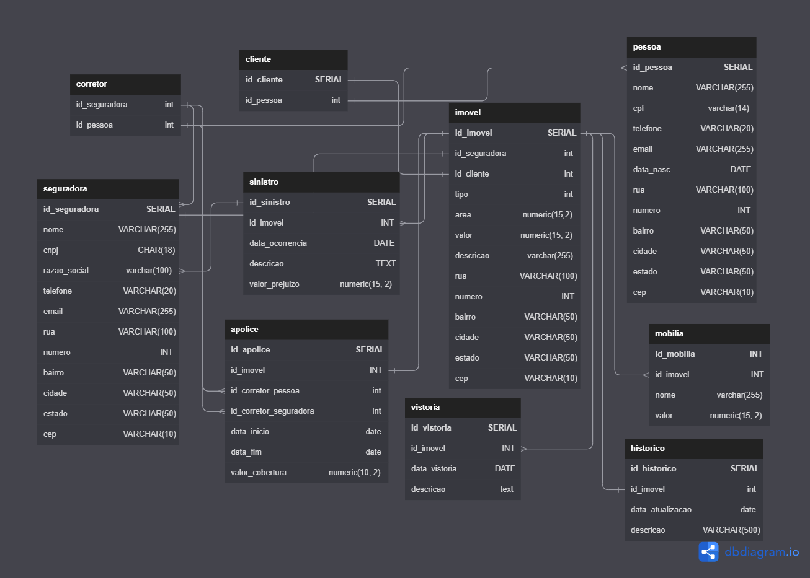

## Projeto Sistema de Seguros de Imóveis
# HUG - House Unforeseens Guardian

<div align="center">
  
</div>

### Grupo A

### Integrantes:
* [Arthur de Luca Honorato](https://github.com/arthurdelucahonorato)
* [Bruna Pacheco Peruch](https://github.com/brupperuch)
* [Guilherme Brito Pizzollo](https://github.com/guilhermebp030504)
* [Guilherme Machado Darabas](https://github.com/gmdarabas)
* [Paulo Roberto Simão](https://github.com/paulorsimao)
* [Renato Ribas Campos](https://github.com/renatoribascampos)
* [Rubens Scotti Junior](https://github.com/rubensscotti)
* [Stephan  Anthony  Marques](https://github.com/stephan-anthony)

### Modelo Físico:
<code>[Arquivo Fonte](https://dbdiagram.io/d/6488f767722eb77494e9558d)</code><br>
<div align="center">
  
</div>

  
### Dicionário de Dados:
<code>[Excel](https://github.com/paulorsimao/HUG/tree/main/dicionario_hug.xlsx) ou [Tabela do Github (markdown)](https://github.com/paulorsimao/HUG/tree/main/dicionario_hug.md)</code>

### Scripts DDL Criação do Database:
<code>[Ver Scripts](https://github.com/paulorsimao/HUG/tree/main/sql)</code>

### Scripts Popula tabelas:
Banco de dados utilizado SQL Server versão 2022 - Azure.<br>
<code>1 arquivo SQL por objeto</code>

### Objetos de BD (stored procedure, triggers e functions):
<code>[Ver Objetos](https://github.com/paulorsimao/HUG/tree/main/sql/objects)</code>
  
### Código do sistema:
JavaScript, PHP (Versão 7), PostegresSQL (Versão 14)<br>
<code>código fonte da aplicação</code>

### Perguntas de negócio:
1 - Quantos clientes terão suas apólices vencidas no período de 6 meses a partir da data atual, das seguradoras do estado de SP, RS e PR?
```sql
  select count(i.id_cliente), s.estado from apolice a 
  left join imovel i on i.id_imovel = a.id_imovel 
  left join seguradora s on s.id_seguradora = i.id_seguradora 
  where a.data_fim between current_date and (current_date + interval '6 months')
  and s.estado in ('SP', 'RS', 'PR')
  group by s.estado;
```
<br>

2 - Liste nome e valor das mobílias dos imóveis, do tipo apartamento, que ultrapassam o valor de 500K reais com apólices criadas no mês atual?
```sql
select id_mobilia, m.nome, m.valor from mobilia m 
left join imovel i on i.id_imovel = m.id_imovel 
where i.tipo = 'Apartamento'
and i.valor > 500000
and i.id_imovel in (
	select a.id_imovel from apolice a where extract (month from a.data_inicio) = extract(month from current_date)
)
```
<br>

3 - liste os imóveis e a quantidade respectiva de mobílias por imóvel que cada cliente tem. Os clientes devem ter entre 30 e 40 anos e residir no estado de SC.
```sql
SELECT
    imovel.id_imovel,
    COUNT(mobilia.id_mobilia) AS quantidade_mobilia
FROM
    imovel
INNER JOIN
    cliente ON cliente.id_cliente = imovel.id_cliente
INNER JOIN
    pessoa ON pessoa.id_pessoa = cliente.id_pessoa
LEFT JOIN
    mobilia ON mobilia.id_imovel = imovel.id_imovel
WHERE
    pessoa.data_nasc BETWEEN '1993-06-26' AND '2003-06-26' -- 30 a 40 anos
    AND pessoa.estado = 'SC'
GROUP BY
    imovel.id_imovel;
```
<br>

4 - Informar o top 10 dos valores totais de prejuizo gerado por sinistros, agrupados por imóvel e trazendo as informações como, nome, cpf,
data de nascimento e telefone da pessoa responsável e o corretor do imóvel.
```sql
SELECT
    imovel.id_imovel,
    pessoa.nome AS pessoa_responsavel,
    pessoa.cpf AS cpf_responsavel,
    pessoa.data_nasc AS data_nascimento_responsavel,
    pessoa.telefone AS telefone_responsavel,
    corretor.id_pessoa AS id_corretor,
    corretor.id_seguradora AS id_seguradora,
    (SELECT nome FROM seguradora WHERE id_seguradora = corretor.id_seguradora) AS nome_seguradora,
    (SELECT telefone FROM seguradora WHERE id_seguradora = corretor.id_seguradora) AS telefone_seguradora,
    SUM(sinistro.valor_prejuizo) AS valor_total_prejuizo
FROM
    sinistro
INNER JOIN
    imovel ON imovel.id_imovel = sinistro.id_imovel
INNER JOIN
    apolice ON apolice.id_imovel = imovel.id_imovel
INNER JOIN
    cliente ON cliente.id_cliente = apolice.id_cliente
INNER JOIN
    pessoa ON pessoa.id_pessoa = cliente.id_pessoa
INNER JOIN
    corretor ON corretor.id_seguradora = imovel.id_seguradora
        AND corretor.id_pessoa = imovel.id_cliente
GROUP BY
    imovel.id_imovel,
    pessoa.nome,
    pessoa.cpf,
    pessoa.data_nasc,
    pessoa.telefone,
    corretor.id_pessoa,
    corretor.id_seguradora
ORDER BY
    valor_total_prejuizo DESC
LIMIT
    10;
```
