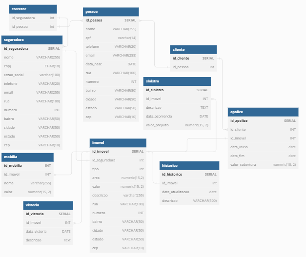

## Projeto Sistema de Seguros de Imóveis
# HUG - House Unforeseens Guardian

  

### Grupo A

### Integrantes:
* [Arthur de Luca Honorato](https://github.com/arthurdelucahonorato)
* [Bruna Pacheco Peruch](https://github.com/brunapperch)
* [Guilherme Brito Pizzollo](https://github.com/guilhermebp030504)
* [Guilherme Machado Darabas](https://github.com/gmdarabas)
* [Paulo Roberto Simão](https://github.com/paulorsimao)
* [Renato Ribas Campos](https://github.com/renatoribascampos)
* [Rubens Scotti Junior](https://github.com/rubensscotti)
* [Stephan  Anthony  Marques](https://github.com/stephan-anthony)

### Modelo Físico:
<code>[Arquivo Fonte](https://dbdiagram.io/d/6488f767722eb77494e9558d)</code> 

  

  
### Dicionário de Dados:
<code>[Excel](https://github.com/paulorsimao/HUG/tree/main/dicionario_hug.xlsx) ou [Tabela do Github (markdown)](https://github.com/paulorsimao/HUG/tree/main/dicionario_hug.md)</code>

### Scripts DDL Criação do Database:
<code>[Ver Scripts](https://github.com/paulorsimao/HUG/tree/main/sql)</code>

### Scripts Popula tabelas:
Banco de dados utilizado SQL Server versão 2022 - Azure. 
<code>1 arquivo SQL por objeto</code>

### Objetos de BD (stored procedure, triggers e functions):
<code>[Ver Objetos](https://github.com/paulorsimao/HUG/tree/main/sql/objects)</code>
  
### Código do sistema:
JavaScript, PHP (Versão 7), PostegresSQL (Versão 14) 
<code>código fonte da aplicação</code>

### Perguntas de negócio:
1 - Quantos clientes terão suas apólices vencidas no período de 6 meses a partir da data atual, das seguradoras do estado de SP, RS e PR?  

2 - Liste nome e valor das mobílias dos imóveis, do tipo apartamento, que ultrapassam o valor de 500K reais com apólices criadas no mês atual?
 

3 - liste os imóveis e a quantidade respectiva de mobílias por imóvel que cada cliente tem. Os clientes devem ter entre 30 e 40 anos e residir no estado de SC.
 

4 - Informar o top 10 dos valores totais de prejuizo gerado por sinistros, agrupados por imóvel e trazendo as informações como, nome, cpf,
data de nascimento e telefone da pessoa responsável e o corretor do imóvel.
